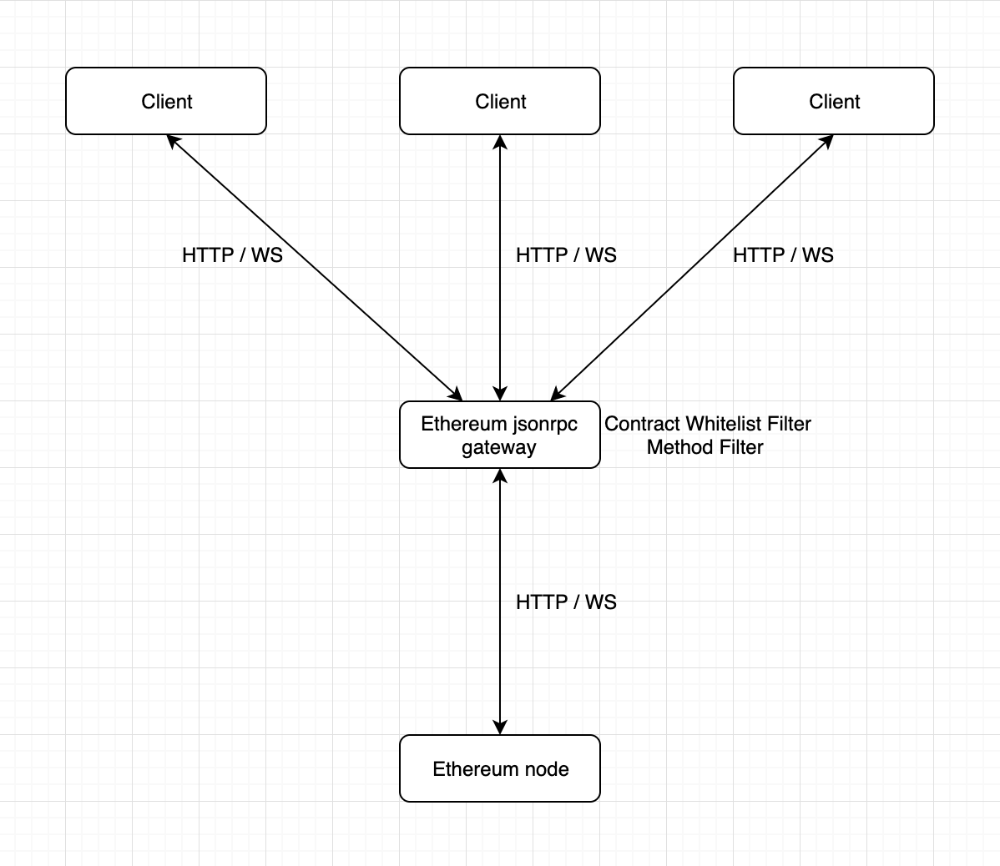
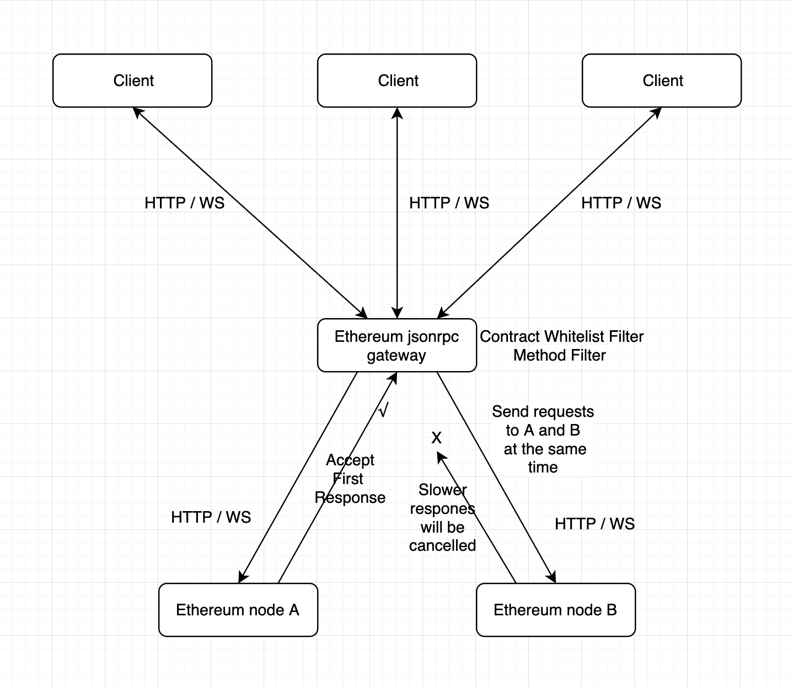
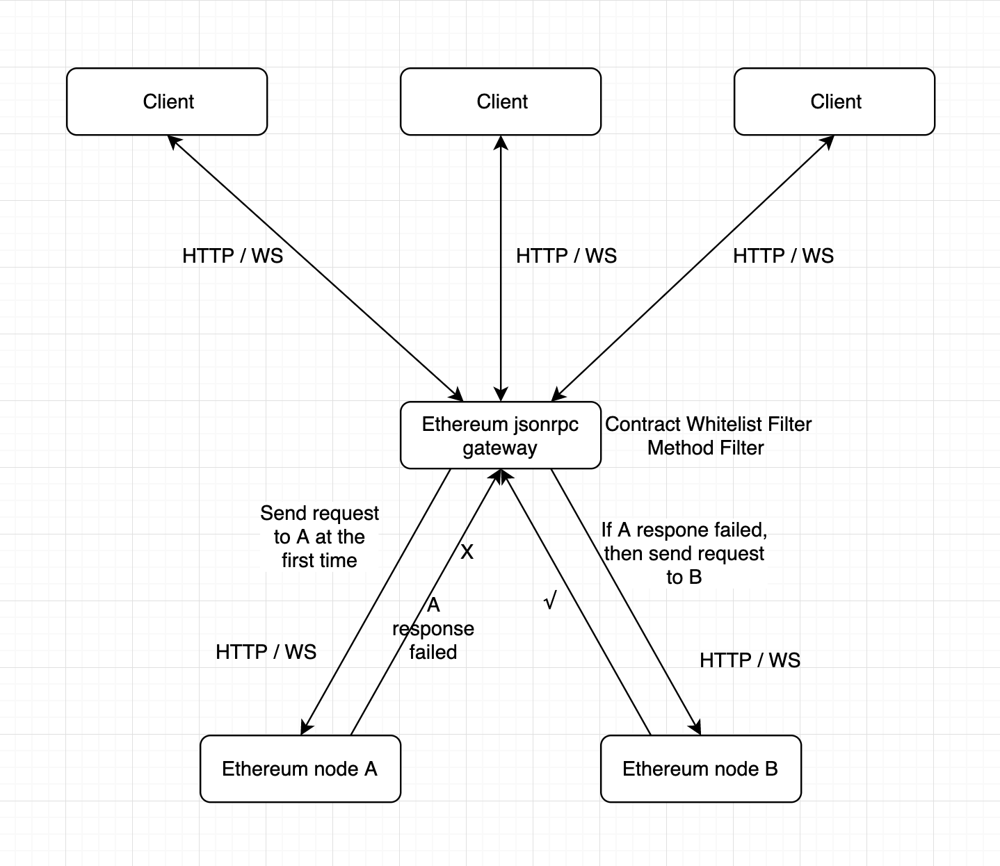

# ethereum-jsonrpc-gateway

A transparent gateway on top of Ethereum nodes for load-balancing, permissions checking, with multi flexible accesses.

## Background

Services that use the Ethereum blockchain typically need to maintain multiple [Ethereum nodes](https://docs.ethhub.io/using-ethereum/running-an-ethereum-node/) in order to interact with on-chain data. Maintaining multiple Ethereum nodes creates a vast array of complications that eth-jsonrpc-gateways helps allieviate.

Using only a single node, while simpler than running multiple, often is insufficient for practical applications (and yields a singular point of failure). Instead, using a series of multiple Ethereum nodes is a standard practice.

ethereum-jsonrpc-gateway was created as a more elegant solution for Ethereum node management. Some of the complexities it addresses are:

- Maintaining uptime while nodes are upgraded and synced frequently

Not all nodes will be available 100% of the time, but eth-jsonrpc-gateway acts as a transparent gateway on top of these nodes: assuring that at least some of them will be available to prevent application failure.

- Load balancing and permission checks are built in

The gateway also acts as a load balancer across the nodes for [rpc](https://ethereumbuilders.gitbooks.io/guide/content/en/ethereum_json_rpc.html) requests. It can also choose to only accept calls from specific addresses and smart contracts.

## Features

- Permisson check - Methods filter
- Permisson check - Smart Contract whitelist
- HTTP
- HTTP upstream
- Websocket
- Websocket rpstream
- Websocket upstream reconnect
- Hot reload configuration
- Graceful shutdown
- Archive data router

## Getting Started

There are two ways you can install and run eth-jsonrpc-gateway: you can build it from the source, or you can use a docker container. We'll go over both here.

### Build From Source

#### Requirements

Go version >= 1.11

#### Steps

1. Clone this repo
2. Copy .config.sample.json to .config.json and Set valid Configuration
3. Install the dependencies:

```
go mod download
```

4. Run

```
go build .
./ethereum-jsonrpc-gateway start     # Started on port 3005
```

### Run Using Docker

1. Clone this repo
2. Copy .config.sample.json to .config.json and Set valid Configuration
3. docker run

```
chmod +x docker-run.sh
./docker-run.sh
```

### Usage

We call the `eth_blockNumber` method (When set `methodLimitationEnabled` true, or `eth_blockNumber` in `allowedMethods`)

```
curl -X POST --data '{"jsonrpc":"2.0","method":"eth_blockNumber","params":[],"id":1}' http://localhost:3005

{"jsonrpc":"2.0","id":1,"result":"0x6c1100"}%
```

And if we set `methodLimitationEnabled` true, and `eth_blockNumber` is not in `allowedMethods`, when we call `eth_blockNumber` the gateway will deny the reqeust.

```
curl -X POST --data '{"jsonrpc":"2.0","method":"eth_blockNumber","params":[],"id":1}' http://localhost:3005

{"error":{"code":-32602,"message":"not allowed method"},"id":1,"jsonrpc":"2.0"}%
```

## Configuration

Copy .config.sample.json to .config.json then edit .config.json

### upstreams

Supports http, https, ws, wss.
eg.

```
  "upstreams": [
    "https://example.com/api/v1"
  ]
```

### strategy

Support NAIVE, RACE, FALLBACK
eg.

```
  "strategy": "NAIVE"
```

[Learn More](#proxy-strategy) about the Proxy Strategy

### methodLimitationEnabled

ture or false, if set false will ignore `allowedMethods` and `contractWhitelist`.
eg.

```
  "methodLimitationEnabled": false
```

### allowedMethods

Allowed call methods, Can be ignored when set `methodLimitationEnabled` false
eg.

```
  "allowedMethods": ["eth_getBalance"]
```

### contractWhitelist

Contract Whitelist, Can be ignored when set `methodLimitationEnabled` false

```
  "contractWhitelist": ["0x..."]
```

## Proxy Strategy

Depending on the level of complexity needed, there are two proxy strategies for eth-jsonrpc-gateway: Basic and Advanced. The pictures below display how these different proxy methods work.

### Basic

- naive (require upstreams count == 1)
  Naive strategy is the most simple one without any magic.
  

### Advanced

- race (require upstreams count >= 2)
  Race strategy proxy mirrors request to the all upstreams, once it receives a response for one of them, then return.
  

- fallback (require upstreams count >= 2)
  Fallback strategy proxy will retry failed request in other upstreams.
  

## Contributing

1. Fork it (<https://github.com/HydroProtocol/ethereum-jsonrpc-gateway/fork>)
2. Create your feature branch (`git checkout -b feature/fooBar`)
3. Commit your changes (`git commit -am 'Add some fooBar'`)
4. Push to the branch (`git push origin feature/fooBar`)
5. Create a new Pull Request

## License

This project is licensed under the Apache 2.0 License - see the LICENSE file for details
